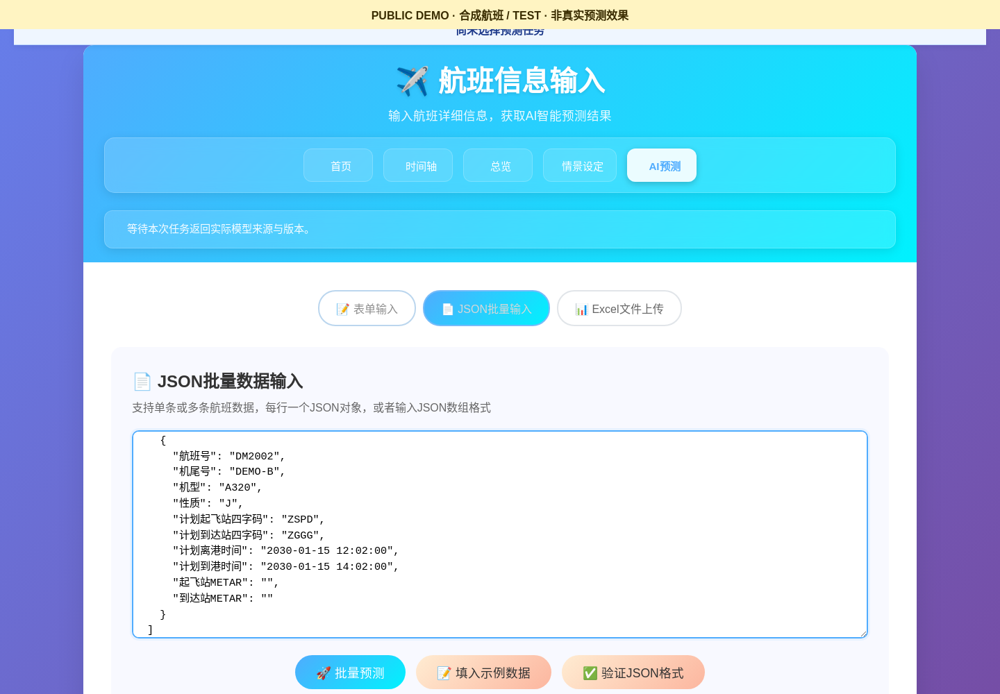
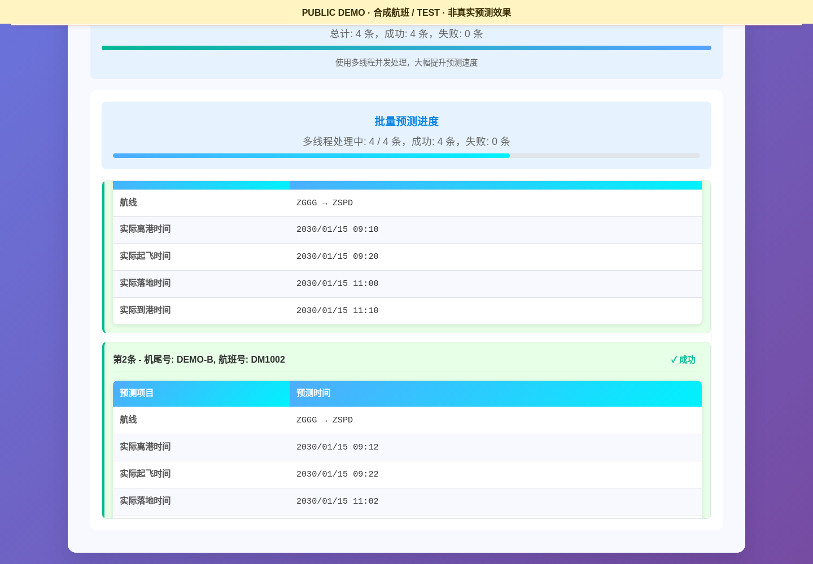
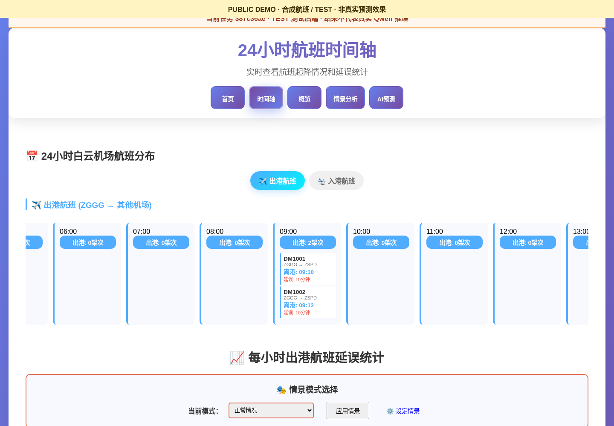
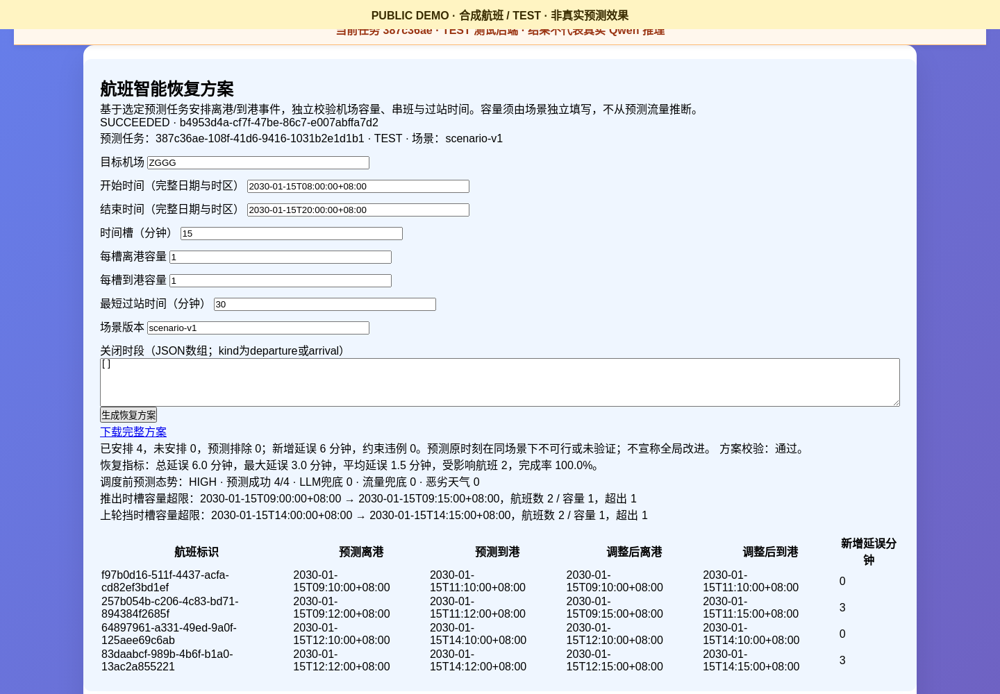
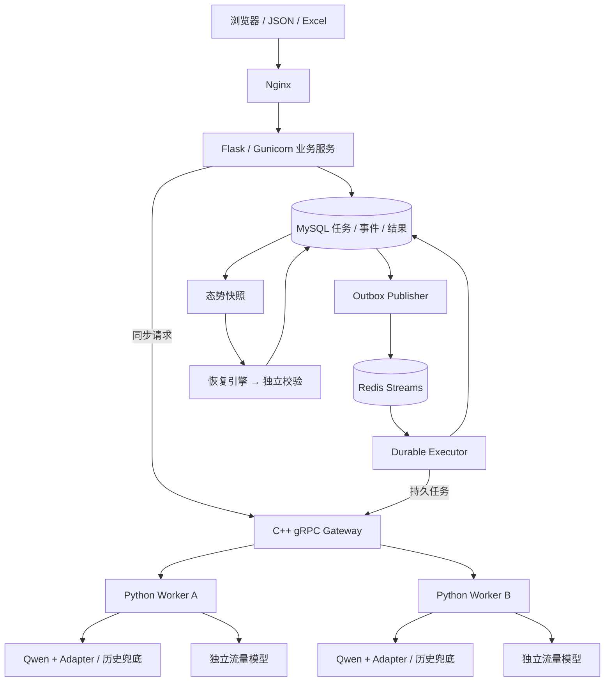

<div align="center">

# Flight Recovery

### 航班态势推演与智能恢复平台

**多源数据预测 · 分布式 GPU 推理 · 运行风险分析 · 约束恢复调度**


[](https://github.com/serhg53fg-ai/flight-recovery-grpc/actions/workflows/ci.yml)

[项目概述](#项目概述) · [核心能力](#核心能力) · [系统架构](#系统架构) · [快速开始](#快速开始) · [文档](#文档导航)

</div>

---

## 项目概述

Flight Recovery 是面向 **广州白云机场（ZGGG）** 的航班运行平台。系统融合航班计划、历史运行和气象信息，预测航班关键时刻及机场起降流量，分析运行冲突，并在容量与串飞约束下生成恢复调度方案。

采用 **Flask 业务服务 + C++ gRPC 网关 + Python GPU Worker** 架构，将业务入口与模型执行分离，支持单服务器运行和跨服务器多 Worker 推理。

```text
航班输入 → 时刻与流量预测 → 态势快照 → 风险识别 → 恢复调度 → 独立校验与结果追溯
```

## 核心能力

| 能力 | 实现与特点 |
|---|---|
| **航班时刻预测** | Qwen3-1.7B + QLoRA Adapter，预测四段时长并重建推出、起飞、落地、上轮挡时刻；历史模型兜底 |
| **机场流量预测** | 独立 GBDT 输出未来 15/30/60 分钟累计起飞、降落与总量；计划流量兜底 |
| **多节点推理** | C++ gRPC 网关，P2C 负载均衡、节点容量、健康检查、熔断与半开恢复、一次受限故障转移 |
| **持久批量任务** | MySQL Outbox + Redis Streams，幂等、租约、心跳与 fence 控制，HTTP 202 与 SSE 事件补读 |
| **态势与恢复** | 不可变快照、容量与串飞风险分析，确定性恢复引擎和独立可行性校验 |
| **部署与追溯** | Nginx、双 Gunicorn、Supervisor、SSH 隧道，工件校验、真实模型身份探针、监控与备份 |

### 业务使用流程

1. **提交航班**：页面、JSON 或 Excel 输入，持久批量任务返回 `job_id`。
2. **查看预测**：展示四时刻、流量窗口、实际模型来源和降级原因。
3. **分析态势**：选定终态任务与恢复场景，冻结输入并识别运行风险。
4. **生成方案**：在容量、关闭窗口和最小过站时间等约束下调整航班，独立校验后查询或下载。

基础 TEST 演示与完整持久业务栈需要不同配置，见下方运行模式。

## 界面预览

以下截图由真实 Web 页面运行生成，输入均为合成航班，后端为 TEST。展示输入、预测、时间线及恢复操作，不代表 Qwen 的预测精度。

| 合成航班输入 | 四时刻预测 |
|---|---|
|  |  |
| **航班时间线** | **态势与恢复** |
|  |  |

[下载和运行合成示例 →](examples/README.md) · [更新记录 →](CHANGELOG.md)

## 系统架构



- **业务层**管理输入、任务、场景和展示；**网关层**控制路由与资源；**Worker 层**执行模型。
- 每个 Worker 加载完整模型，并行处理不同请求，属于**请求级分布式推理**。
- MySQL 保存最终状态，Redis 分发任务；浏览器断开后可按任务查询或补读事件。
- 多服务器可通过 SSH 隧道连接回环 gRPC 端口，实际连接配置与凭据不进入仓库。

[完整链路与数据口径 →](docs/architecture.md)

## 快速开始

### 1. 选择运行模式

| 模式 | 需要准备 | 用途 |
|---|---|---|
| **无 GPU / TEST** | Python 与 C++ gRPC 构建环境 | 体验 Web → Gateway → Worker 工程链路 |
| **单 GPU / Qwen** | 完整基座、Adapter、历史与流量工件 | 真实模型推理；完整业务另需持久栈配置 |
| **多服务器 / 多 Worker** | 每端模型、节点清单与受控网络连接 | 分流、容量控制及故障转移 |

公开仓库不附带业务数据、模型或运行数据库。TEST 输出会明确标记，不能用作真实模型精度证据。

### 2. 环境要求

| 依赖 | 要求 |
|---|---|
| Python | 3.10 |
| C++ | 支持 C++17 的编译器 |
| CMake | ≥ 3.16 |
| RPC 构建依赖 | Protobuf、gRPC C++、`grpc_cpp_plugin` |
| GPU 模式 | 与服务器 CUDA 兼容的 PyTorch，完整本地模型工件 |

Ubuntu/Debian 需先安装与 Python 版本匹配的 `python3.10-venv`（详见部署教程）。系统依赖需按操作系统准备；下面命令不会自动安装 gRPC C++ 或 CUDA。

### 3. 启动无 GPU 演示

```bash
git clone https://github.com/serhg53fg-ai/flight-recovery-grpc.git
cd flight-recovery-grpc

python3 -m venv .venv
.venv/bin/python -m pip install -r requirements-dev.txt
bash scripts/generate_proto.sh

cmake -S gateway -B build/phase2 -DCMAKE_BUILD_TYPE=Release
cmake --build build/phase2 -j2

.venv/bin/python scripts/run_local.py --backend test --worker-count 2
```

打开 **http://127.0.0.1:5000/flight_input**。使用 `Ctrl+C` 停止启动器创建的进程。

此入口不自动启用完整 MySQL/Redis 持久栈；真实模型与跨服务器部署请阅读[部署说明](docs/DEPLOYMENT.md)。

## 项目结构

```text
flight-recovery-grpc/
├── apps/flight/          # Web、任务状态、态势快照、恢复服务与页面
├── gateway/             # C++ gRPC 调度、容量、健康、熔断与指标
├── services/inference/  # Python Worker、Qwen 和组合兜底
├── proto/               # 版本化 Protobuf/gRPC 协议
├── training/            # 数据与天气特征、基线、流量、QLoRA 和评测
├── deploy/              # 常驻角色和跨实例通用部署实现
├── configs/             # 本地及实验配置模板
├── scripts/             # 启动、验收、监控、备份和发布审计
├── tests/               # 单元、集成、故障、训练与浏览器测试
├── examples/            # 合成 JSON、TEST 参考输出与 Excel 生成器
├── images/              # 带合成数据标记的真实页面截图
├── .github/workflows/   # 公共源码自动检查
├── docs/                # 架构、部署、配置、验证和公开范围
└── reports/             # 测试输出占位
```

旧应用脚本为兼容与追溯保留，定位见[入口与历史代码](docs/LEGACY.md)。当前入口以统一 `PredictionService`、持久任务 API 和恢复服务为准，不依赖原项目目录或旧 mprpc 工程。

## 验证

默认回归 **617 项通过、127 项跳过**，C++ `gateway_core` 通过。显式启用独立 MySQL、Redis、Nginx/Gunicorn、浏览器及原模型 CPU 依赖后，完整套件 **743 项通过、1 项因无 GPU 跳过**；同一 GPU 用例已在学校 A100 独立测试栈通过。已按用例标识核对全部 744 个 Python 用例均完成执行，跨环境结果不代表预测精度或代码覆盖率。复现步骤见[验证说明](docs/VALIDATION.md)。

GitHub Actions 将自动安装依赖、构建网关、运行默认回归及公开文件审计；它不执行真实 GPU 或跨服务器验收。

```bash
# 部分集成测试使用另一构建目录名；已有该目录时请分别构建，不覆盖。
ln -s phase2 build/phase2-release
.venv/bin/pytest -q
ctest --test-dir build/phase2 --output-on-failure

# 输出路径须不存在；审计不回显疑似密钥内容。
.venv/bin/python -m scripts.release_audit --root . --output /tmp/release-audit.json
```

真实 GPU 闭环、双节点分流、故障转移与熔断恢复已验收。这些记录不等于长期容量、生产 SLA 或任意镜像恢复保证。

## 文档导航

| 文档 | 建议阅读目的 |
|---|---|
| [架构与业务链路](docs/architecture.md) | 理解远程推理、持久执行、态势与恢复如何衔接 |
| [部署教程](docs/DEPLOYMENT.md) | 构建源码，启动 TEST、持久栈和真实模型 |
| [合成示例](examples/README.md) | JSON/Excel 输入、参考输出和截图复现 |
| [GPU 与多服务器](docs/GPU_DEPLOYMENT.md) | 准备私有工件、连接远端 Worker 和验收 |
| [配置说明](docs/CONFIGURATION.md) | 节点容量、角色路径和发布身份 |
| [常见问题](docs/TROUBLESHOOTING.md) | 定位依赖、端口、模型与恢复故障 |
| [入口与历史代码](docs/LEGACY.md) | 区分当前实现和兼容脚本 |
| [模型与验收边界](docs/VALIDATION.md) | 查看指标口径、实验结果和已知限制 |
| [公开范围与安全配置](docs/PUBLICATION.md) | 区分占位模板、实际配置与私有凭据 |

## 数据与许可

自行准备获得授权的航班资料与模型工件，运行时不自动下载 Qwen 权重。实际密钥、密码、令牌、原始数据、模型、数据库与运行配置均不在公开包中。

第三方库遵循各自许可证，模型与数据授权单独管理。当前仓库未指定统一开源许可证，公开可见不代表授予任意再分发许可。

---
