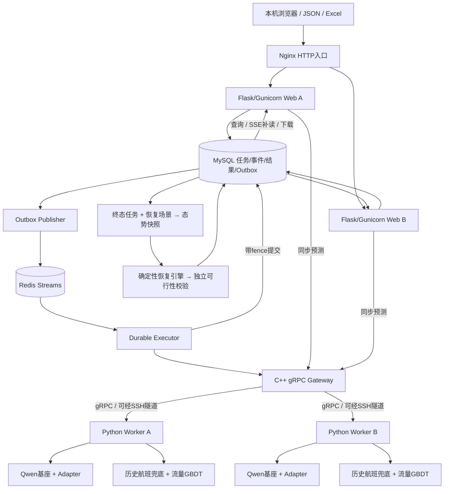

# 架构与完整业务链路

## 1. 部署架构

Web 负责业务，Gateway 负责远程调度，Worker 负责模型推理。MySQL 保存跨进程状态，Redis 分发持久任务。图中数据库箭头表示读写关系，并不意味着 MySQL 自己执行业务逻辑。

## 2. gRPC 如何传给大模型

1. 用户提交航班计划；Web 规范化机场、时间和数值，检查 ZGGG 范围及截止时刻上下文。当前 Gateway 要求 prediction_cutoff 等于计划离港时刻，不是任意滚动时刻。
2. Python gRPC 客户端构造 PredictRequest，序列化为 Protobuf，调用 C++ Gateway。
3. Gateway 从健康、有剩余容量且未熔断的 Worker 中选择节点，转发请求及剩余 deadline。
4. Python Worker 接收并解码同一协议，将结构化字段交给组合推理适配器。
5. Qwen 适配器将允许的特征转换成版本化提示词，调用该 Worker 本机 GPU 上已加载的模型及 Adapter；这里不是再调用 ChatGPT 或外部聊天接口。
6. 适配器解析生成的四个时长分量，校验并重建航班时刻；组合适配器同时调用独立流量模型。
7. Worker 返回 PredictResponse，包含四时刻、流量、来源、模型版本、worker_id、耗时、天气与降级标记。
8. Gateway 将响应交回业务客户端；业务服务校验后持久化并供页面、JSON、SSE 和下载使用。

**gRPC 是传输与调用框架，不是预测模型。** 模型部署在 Worker 所在 GPU 服务器；本机可以只负责输入和查看结果。本地 Web 也可以放在业务服务器，本机浏览器通过 HTTP 访问它。

协议：proto/flight/v1/prediction.proto。时间使用 UTC Timestamp；展示层按指定时区转换。新增上下文字段采用追加编号，避免破坏旧字段契约。

## 3. 同步和持久异步有什么区别

同步：Web → Gateway → Worker → Web。适合单条交互及快速联调，请求连接需等待结果。

持久异步：Web 在 MySQL 事务内写入任务、输入快照和 Outbox 后返回 HTTP 202；Publisher 将消息投递 Redis Stream，Executor 领取任务并调用 Gateway，结果写回 MySQL。浏览器可断开后再通过 job_id 查询或补读 SSE。

关键机制：

- 幂等键控制重复提交；Outbox 避免数据库任务与队列发布之间的丢失窗口。
- Consumer Group 分发消息；租约、心跳和 fence token 控制任务执行所有权。
- 失联任务有界恢复；迟到执行器不能覆盖新执行结果。
- 消息可以重投，模型可能重复执行；不能将这套机制宣传为所有外部操作 exactly-once。
- SSE 传输任务事件与进度，不代表 Qwen token 流式生成。
- MySQL 是事实来源，Redis 不是结果主存储；不能只保留 Redis 就恢复完整业务。

## 4. 两类预测怎样配合

### 航班时刻

当前 Qwen 预测四个时长分量：离港延误、滑出、空中、滑入。以计划离港为起点逐段重建推出、起飞、落地、上轮挡时刻，并执行时间顺序校验。模型输入、单位和提示词版本必须与 Adapter 元数据一致。

主预测为 Qwen3-1.7B + adapter-iem-v4。Qwen 不可用时由历史航班模型兜底，返回 BASELINE 来源与 flight_degraded、原因。这个兜底解决可用性，不会自动识别每一次“看似正常但预测不准”的 LLM 输出。

### 机场流量

预测未来 15/30/60 分钟 ZGGG 起飞、降落和总量，当前主模型为 GBDT，失败回退计划量并记录 flow_degraded。累计窗口采用 [start,end)，不能理解为单航班延误，也不能将重叠预测相加。

训练按 15 分钟 cadence 构建快照；在线结果绑定请求截止时刻，不代表系统已接入全天候实时机场事件流。工件与输出校验保证非负和总量相等；累计窗口跨 horizon 的单调性是否满足，应以对应工件/校验实现为准，不把业务期望写成未验证保证。

## 5. 天气和时间边界

机场级业务只针对 ZGGG；外站天气可辅助单航班预测。METAR 选择截止时刻前的合法实况；TAF 需要在截止前发布并覆盖目标有效时段。缺失、陈旧均显式标记，不用未来报文填补。

当前真实训练资料只有 2025 年五月，已使用 ZGGG METAR；TAF 缺失不能描述为已获得完整 TAF 训练覆盖。协议支持某类数据与实际拥有该数据是两回事。

未来实际起降数、实际航程、实际飞行时间和四个真实运行时刻只能作标签或审计，不能作提前预测特征。训练边界还必须剔除尚未完成标签的航班。现有资料缺少部分接收/入库时间，回放的时间安全仍依赖已声明的事件时间假设。

## 6. 态势和恢复如何形成闭环

1. 预测任务进入终态，成功与失败航班均有明确记录。
2. 选定版本化恢复场景，给定容量、关闭窗口、机尾串飞与最小过站时间等。
3. snapshot.py 从任务和场景构造不可变快照，汇总来源、降级、天气、流量压力和冲突，计算 SHA-256。
4. 恢复引擎在预测基础上生成满足约束的调整候选。
5. 独立校验器检查时刻顺序、离港/到港容量、关闭窗口、串班和最小过站时间。恢复约束中的 departure/arrival 不能直接解释成真实跑道起飞/落地占用。
6. 保存方案、同一快照及摘要，使用户可以追溯恢复依据，并查看/下载结果。

恢复过程中不重新调用模型，不修改原预测。失败预测或不完整流量必须显式处理，不能补成虚假成功。旧任务若只有总流量，不能据此推断起飞/降落方向压力。

## 7. 多 Worker 的作用与限制

Gateway 使用 P2C（抽两个候选再比较负载）、节点容量 permit、Health、熔断及一次受限故障转移。取消、剩余 deadline 和标准 gRPC 错误沿调用传播。

这是**请求级分布式推理**：多个 Worker 各自加载完整模型，处理不同请求。不是把一个 Qwen 拆到两个服务器做张量并行，也不保证请求数严格平均。增加 Worker 主要改善吞吐与容错，不直接提高单条预测精度。

准入顺序为工件与发布清单校验 → Health → 真实预测身份探针 → 写入 Gateway 节点池。检查 Worker、主模型、流量和兜底身份，错误或旧工件不会仅因为端口能连通而被接纳。

## 8. 故障与可追溯性

| 情况 | 行为 |
|---|---|
| Qwen 推理失败 | 历史航班模型兜底，标明来源与原因 |
| 流量模型失败 | 计划流量兜底，保留独立降级标记 |
| 一个 Worker 不可用 | 熔断及有界故障转移至其他节点 |
| 全部 Worker 不可用 | 明确失败；持久任务按策略有界重试 |
| Web 退出或浏览器断开 | 任务仍存 MySQL，其他实例查询/补读 |
| Executor 失联 | 租约恢复；旧 fence 提交被拒绝 |
| 发布身份不一致 | 控制面拒绝或剔除节点 |

追溯键包括 trace_id、job_id、Worker、模型/数据/提示词版本、来源和降级原因、态势摘要及恢复方案版本。日志和 Prometheus 指标用于观察排队、容量、失败和熔断；配置示例存在不等于已经部署完整 Grafana 平台。

## 9. 用一个航班理解完整流程

以下数字仅用于说明，不是实测预测或机场真实容量。

假设一班ZGGG出港航班计划10:00推出、12:00到港，当前预测截止为计划10:00。Web只能提交该截止前可用的天气和历史特征，不得提交10:20才发布的METAR。

1. 提交批量任务，返回job_id；输入、Outbox和任务在同一MySQL事务中保存。
2. Executor领取任务后，经Gateway调度到Worker A。假设Qwen输出延误20、滑出15、空中90、滑入10分钟。
3. 重建结果：10:20推出→10:35起飞→12:05落地→12:15上轮挡。流量结果是独立模型对10:00后15/30/60分钟的累计起降数，不能从这一班推导整个机场流量。
4. 任务终态后，选择恢复场景，形成冻结快照。若10:20所在离港时隙已满，恢复引擎向后寻找可行推出时刻，并检查到港容量和后续串班MTT。
5. 独立校验通过后保存方案和快照摘要。页面按同一job_id查看原预测与调整方案，不读取其他任务的最新Excel。

两种故障需要区分：Worker A端点不可用时，Gateway可能在剩余预算内转到B；A仍在线但Qwen输出非法时，组合适配器可能执行历史模型兜底并标明BASELINE与降级原因。后者不是跨节点故障转移。

### 容量风险的两个口径

累计流量压力使用独立流量模型的起飞/降落窗口；时槽容量风险按预测推出/上轮挡事件，在恢复场景起点锚定的半开时间槽中计数。后者按恢复引擎的“不早于计划”规则取计划与预测时刻的较晚者，再与恢复校验采用相同的机场、时间槽和容量口径，并不代替真实跑道占用模型。即使 TEST 没有流量输出，也能识别预测事件的时槽超限。

恢复页的“调度前预测态势”来自冻结的原预测快照；“方案校验”针对调整后的分配结果。调度前 HIGH 与调整后校验通过可以同时成立，不代表风险分析未更新，也不说明方案仍存在已校验的容量冲突。
